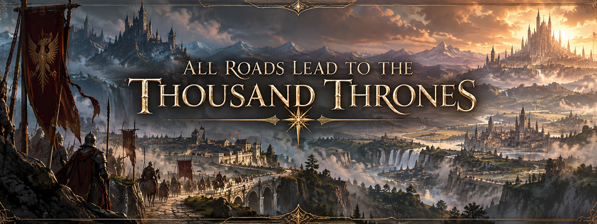

  
  
A continent divided. A thousand crowns.<a href="#avara">Enter the world ↓</a>

The world chronicle · Chapter I

# Avara

A thousand roads leading toward a thousand thrones.

<nav class="chapter-jumps" aria-label="Explore this chapter"><a href="#a-continent-divided">The divided continent</a><a href="#the-empires-ambition">The Empire</a><a href="mana/">Mana &amp; Praedari ↗</a></nav>

## A continent divided

Avara stretches across nearly Sixty million square kilometers of land, vast enough for kingdoms to rise, conquer their neighbors, and vanish before distant peoples ever learn their names.

There has never been one war upon Avara.

There have been thousands.

Human kingdoms crowd against one another and against everyone beyond them. Elven realms carry grievances measured in centuries, divided from other peoples and often from their own kind. Dwarven holds remember broken oaths long after the kingdoms responsible have disappeared. Orc tribes gather beneath new chiefs and old hatreds. Goliaths wander across borders drawn by people who believe every stretch of earth must belong to someone.

Every people remembers what was taken from them.

Every kingdom remembers what it believes it is owed.

Every ruler inherits a map covered in unfinished arguments.

So armies march.

For land. For pride. For security. For vengeance. For gods, crowns, old promises, older insults, and the simple fear that if they do not strike first, someone else eventually will.

Peace exists when exhaustion permits it.

Treaties are signed. Borders quiet. Sons are born who have never seen battle.

Then someone decides the balance has changed.

And the roads fill with soldiers again.

Through all of it moves mana, carried in root and beast, king and soldier, human and elf alike. Most live and die with only what nature gave them. A few learn to gather more and become Praedari, giving old ambitions enough strength to break armies and redraw nations.

This is Avara.

A continent of peoples united beneath their own banners and divided against those beyond them.

A thousand crowns.

A thousand claims.

A thousand roads leading toward a thousand thrones.

## The Empire’s ambition

Yet one empire looks upon this endless division and sees something far worse than tragedy.

It sees inferiority.

A continent squandered beneath lesser crowns. Peoples kept apart by petty kingdoms, old customs, provincial loyalties, and rulers too small to understand what history demands of them.

It does not seek peace between nations.

It seeks the end of their necessity.

Human, elf, dwarf, halfling, goliath. All may stand beneath its banner, so long as they understand which identity comes first.

Sovereignty does not.

What the Empire conquers, it absorbs. What it finds useful, it perfects. What resists, it breaks until resistance becomes memory.

To its people, this is not cruelty.

It is proof.

Proof that their laws are stronger. Their armies better. Their institutions greater. Their civilization worthy of inheriting what weaker kingdoms have failed to protect.

They do not believe all nations are equal.

They believe history has already judged them.

One law.

One civilization.

One future.

The rest of Avara calls it arrogance.

The Empire calls it destiny.

---

[Continue to Mana →](mana.md)
